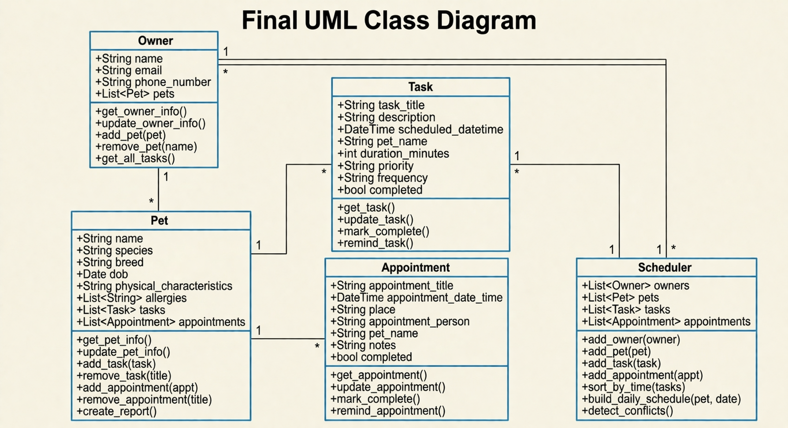
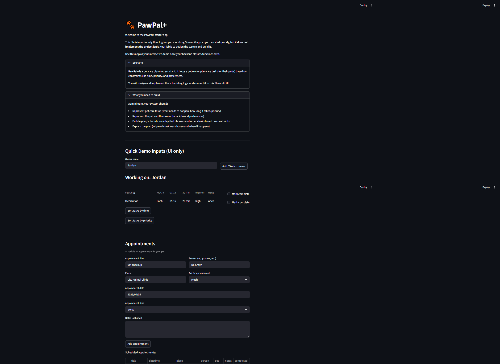
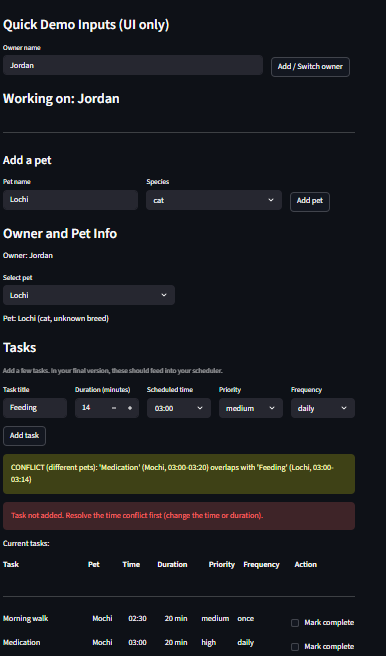
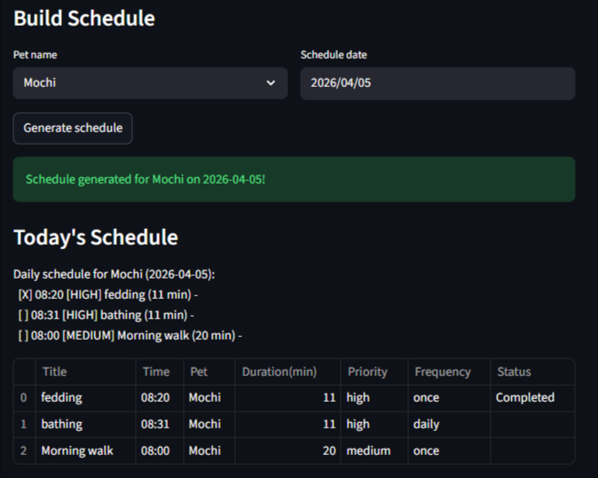

# PawPal+ (Module 2 Project)

You are building **PawPal+**, a Streamlit app that helps a pet owner plan care tasks for their pet.

## Scenario

A busy pet owner needs help staying consistent with pet care. They want an assistant that can:

- Track pet care tasks (walks, feeding, meds, enrichment, grooming, etc.)
- Consider constraints (time available, priority, owner preferences)
- Produce a daily plan and explain why it chose that plan

Your job is to design the system first (UML), then implement the logic in Python, then connect it to the Streamlit UI.

## What you will build

Your final app should:

- Let a user enter basic owner + pet info
- Let a user add/edit tasks (duration + priority at minimum)
- Generate a daily schedule/plan based on constraints and priorities
- Display the plan clearly (and ideally explain the reasoning)
- Include tests for the most important scheduling behaviors

## Getting started

### Setup

```bash
python -m venv .venv
source .venv/bin/activate  # Windows: .venv\Scripts\activate
pip install -r requirements.txt
```

### Suggested workflow

1. Read the scenario carefully and identify requirements and edge cases.
2. Draft a UML diagram (classes, attributes, methods, relationships).
3. Convert UML into Python class stubs (no logic yet).
4. Implement scheduling logic in small increments.
5. Add tests to verify key behaviors.
6. Connect your logic to the Streamlit UI in `app.py`.
7. Refine UML so it matches what you actually built.

### Smarter Scheduling: Summarizing and New Features

| Class | Primary Responsibility | Key Attributes & Logic |
| :--- | :--- | :--- |
| **Appointment** | **Professional Tracking** | Manages vet/groomer visits with `datetime`, `place`, and `person`. |
| **Task** | **Care Activity** | Represents single events with `priority`, `duration`, and `frequency`. |
| **Pet** | **Profile Management** | Acts as the data owner for species, breed, allergies, and scheduled tasks. |
| **Owner** | **User Management** | Manages multiple pets and aggregates tasks across the entire household. |
| **Scheduler** | **Central Brain** | Executes the core logic for sorting, filtering, and conflict detection. |

#### Conflict Detection (Interval-Based)
Unlike basic schedulers that only check for exact time matches, PawPal+ uses **Interval-Based Conflict Detection**. By calculating the "time window" of an activity ($Start + Duration = End$), the system identifies overlapping schedules. This ensures that the plan is physically possible for the owner to execute across multiple pets.

#### Strategic Priority & Temporal Constraints
I prioritized **Temporal and Priority Constraints** because they address the two biggest challenges of multi-pet ownership: **operational feasibility** and **triage focus**. By implementing a weighted sorting system, the scheduler ensures that **high-acuity care** (like medication) is never **obscured** by **standard maintenance workflows** (like grooming).

---
## Final UML Class Diagram



## Features

**1. Sort Tasks by Time (`sort_by_time`)**
Sorts any list of tasks into chronological order using Python's built-in `sorted()` function. Each task's `scheduled_datetime` is formatted as an `HH:MM` string and used as the sort key, ordering tasks from earliest to latest within a 24-hour window. Returns a new sorted list without modifying the original.

---

**2. Mark Task Complete (`mark_task_complete`)**
Marks a task as completed and automatically handles recurring tasks. If the task's frequency is `daily` or `weekly`, the scheduler computes the next occurrence by adding a 1-day or 7-day `timedelta` to the original scheduled time, creates a new identical task at that future time, and appends it to both the scheduler's task list and the owning pet's task list. One-time (`once`) tasks are simply marked done and no new task is created.

---

**3. Detect Conflicts (`detect_conflicts`)**
Uses a pairwise comparison algorithm (O(n²)) to check every combination of active (non-completed) tasks for time overlaps. For each pair, it computes each task's start and end time (start + duration), then applies the standard interval-overlap condition: `task_a.start < task_b.end AND task_b.start < task_a.end`. When an overlap is found, it generates a warning message identifying both tasks, their pet names, and their time windows, and notes whether the conflict is between tasks for the same pet or different pets.

---

**4. Build Daily Schedule (`build_daily_schedule`)**
Filters the scheduler's task list down to tasks matching a specific pet name and target date, then sorts the result using a two-level composite key: **priority first** (high → medium → low, mapped to integers 0, 1, 2 via `_PRIORITY_ORDER`), then **scheduled time** as a tiebreaker. This ensures the most critical tasks always appear first within the day's plan, with earlier times breaking ties between tasks of equal priority.

## Demo Screenshot





