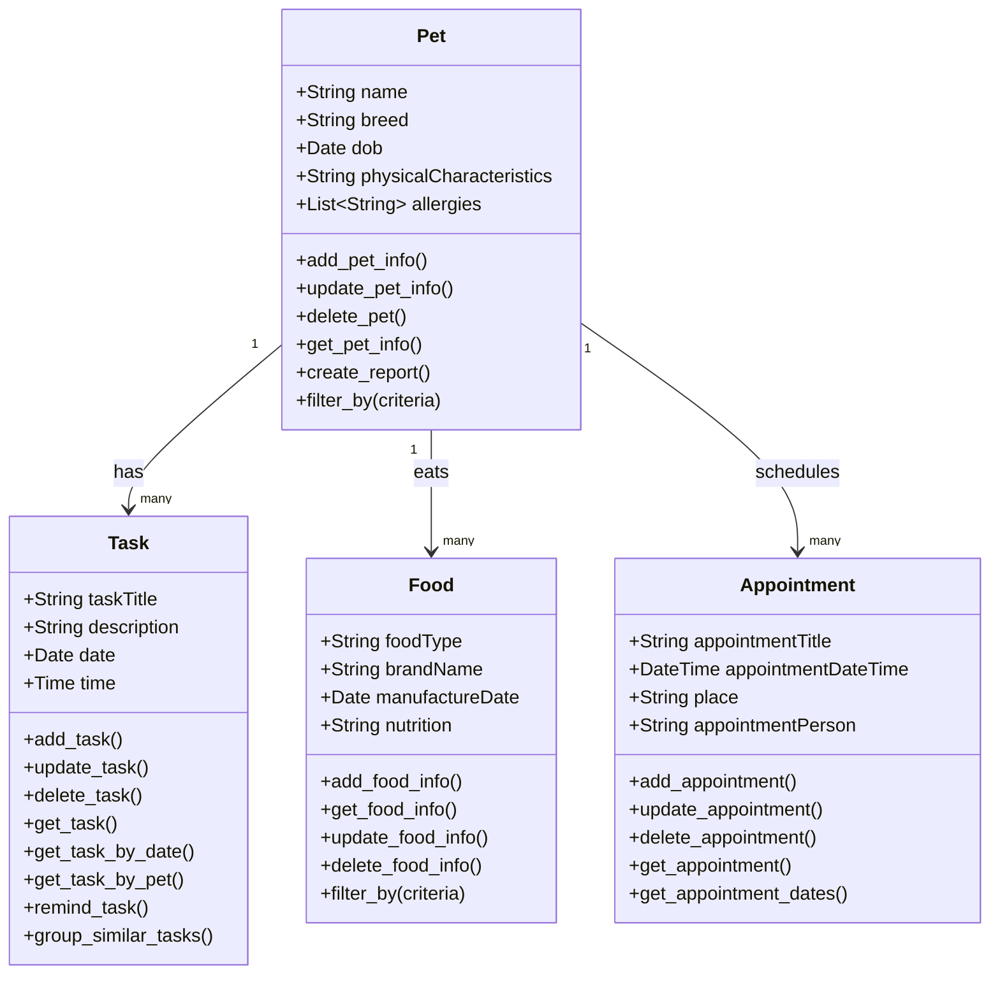

# PawPal+ Project Reflection

## 1. System Design

Three core actions a user should be able to perform 1. User should be able to all CRUD actions related to a pet 2. User should be able to manage tasks related to a pet 3. User should be able track the general health of a pet

**a. Initial design**

- Briefly describe your initial UML design.
- What classes did you include, and what responsibilities did you assign to each?
  While this system includes many classes , I have focued on the following 4 classes,their attributes, and methods(responsibilities).

### classes

    Pet class
    This class is responsible for the management of data related tpo pets.

    class:Pet
    attributes:
        name
        age/DOB
        breed
        physical characteristics
        allergies

    methods:
        add_pet_Info
        update_pet_Info
        delete_pet
        get_pet_Info
        create_report
        filter_by(criteria)

    Task class
    This class store and manage information related to tasks assigned to a pet

    class: Task
    attributes:
        task_title
        description
        date
        time

    methods:
        add_task
        update_task
        delete_task
        get_task
        get_task_by_date
        get_task_by_pet
        remind_task
        group_similar_task

    Food class: This class is for managing information related to pet food
    class: Food
    attributes:
        food_type
        brand name
        manufacture date
        nutrition

    methods:
        add_food_info
        get_food_Info
        update_fod_Info
        delete_food_Info
        fitlert_by(criteria)

Appointment class:This class manage all the data and actio related to appointments related to pet/pet care
class: Appointment

attributes:
appointment_title
appointment_date_time
place
appointment_person

methods:
add_apointment
update_appointment
delete_appointment
get_appointment
get_appointment_dates

**Mermaid.js Class Diagram**

**b. Design changes**

- Did your design change during implementation?
- If yes, describe at least one change and why you made it.

There were some changes to the skeleton. I made some changes by myself , however, for adding new classes and other major changes weere made with the assistance of AI.

Two changes are made to establish relationship between classes , these changes were added
1.  Removed the Food class, and added the Owner class.
    While the Food class can be added to support FeedingTask or NutritionTracker, I think owner class is core class at this point of system designing. Therefore, I decided to remove the Food class at this stage of designing process.The Food class could be added as the system chanhes due to new requirements.

1. Add pet_name: str as an attribute on Task class
   Althought the get_task_by_pet(self, pet_name: str) of the Task class takes a str, the Task class has no pet attribute. Therefore it can never actually filter by pet from within the Task class. Thus, the solution is to add pet_name: str as an attribute on Task class.

2. Add pet_name: str to both Food and Appointment.
   Pet class holds lists of Food and Appointment, however, Food and Appointment classes have no link to Pet class. Therefore, Add pet_name: str (or pet: "Pet") to both Food and Appointment.

#### Some other changes

4. Converted filter*by, get_task_by*\*, group_similar_tasks, get_appointment_dates to @staticmethod — they now take the full list as a paramete
   Food.filter_by(criteria) is an instance method on a single food object — it can't filter a collection of foods. Same issue on Pet.filter_by.
   Task.get_task_by_date and get_task_by_pet are instance methods on a single task — they'd need access to all tasks to return a list.
   These should either be @classmethod / @staticmethod methods, or moved to a separate PawPalScheduler / registry class that holds the full collections.

5. Task.time is typed as str
   Using a bare str for time makes scheduling logic fragile — comparing or sorting tasks by time will break. Should be datetime.time or combined into a single datetime.
   Changed to datetime.time, renamed field to scheduled_time to avoid shadowing the time type

6. Added Scheduler class with add/delete methods for all entities, plus build_daily_schedule and explain_schedule stubs
   This is becasue instance methods such as task.add_task() are unclear with no storage layer (list, DB, etc.) that these methods can operate on. Thus, these methods moved to a manager/scheduler class.

---

## 2. Scheduling Logic and Tradeoffs

**a. Constraints and priorities**

- What constraints does your scheduler consider (for example: time, priority, preferences)?
constaints of the schedular
    - Temporal Constraints (Time & Duration)
        - Chronological Sequence:
            - sort_by_time method
            - build_daily_schedule method
        - conflict deletection
            - detect_conflicts method
        - Recurrence Logic
            - mark_task_complete method

    - Priority Constraints (Importance)
        Ranked by using the _PRIORITY_ORDER dictionar. The scheduler shows "High" priority tasks at the top of a daily list, even if a "Low" priority task is scheduled for an earlier time.
    - Relational & Scope Constraints
        Define "who belongs to whom" so data doesn't leak between different pets or owners.
        - Pet Attribution(Pet Class )
            - add_task method
            - add_appointment method
        - Owner Boundaries
            The Owner class acts as a container constraint. For example, calling get_all_tasks method, the scheduler is restricted to only pulling data from the specific list of pets assigned to that one owner.
    - Status Constraints (Lifecycle)
        For example, in methods such as detect_conflicts and create_report, the scheduler distinguishes between completed and pending states. It ignores "Done" tasks when checking for time conflicts, as finished tasks no longer take up "active" time.

- How did you decide which constraints mattered most?I prioritized Temporal and Priority Constraints because they address the two biggest challenges of multi-pet ownership: feasibility (completing tasks successfully) and focus (knowing what matters most).

    Priority Constraints matter most becasue this hierarchy ensures that crtical task, such as medication, are prioritized over routine tasks like grooming.
    
    Temporal Constraints (specifically conflict detection) are essential for feasibility; a schedule is only useful if it is physically possible to complete. By checking for overlaps using duration_minutes, the scheduler moves from being a simple list to a functional planning tool.

**b. Tradeoffs**

- Describe one tradeoff your scheduler makes.
    Within the current scope of the scheduler, the sorting logic is designed primarily for organizing tasks within a single given day. Although the program allows users to enter tasks spanning an entire week or month, the current sort_by_time method does not account for the date. Consequently, it cannot sort a multi-day list chronologically by both date and time; it is strictly limited to ordering tasks by their time attributes within a single 24-hour window.

- Why is that tradeoff reasonable for this scenario?
    This tradeoff is a deliberate design choice intended to prevent information overload. While the system allows for long-term planning, presenting a pet owner with an entire week's worth of tasks at once can be overwhelming. By restricting the sorting logic to a single-day view, the scheduler maintains a high level of focus and clarity,which ensures that the owner only sees the most actionable tasks for the current 24-hour period, rather than being distracted by future obligations that do not require immediate attention.

---

## 3. AI Collaboration

**a. How you used AI**

- How did you use AI tools during this project (for example: design brainstorming, debugging, refactoring)?
- What kinds of prompts or questions were most helpful?

**b. Judgment and verification**

- Describe one moment where you did not accept an AI suggestion as-is.
- How did you evaluate or verify what the AI suggested?

---

## 4. Testing and Verification

**a. What you tested**

- What behaviors did you test?
Following methods of the Scheduler class were tested for their functionalty.  

* **`sort_by_time`**
    Orders a list of tasks by comparing their "HH:MM" time strings. This provides a daily sequence but ignores date differences, effectively "stacking" tasks from different days if they share the same time.

* **`build_daily_schedule`**
    Filters the master list for a specific pet and date, then sorts them by weight—first by a predefined priority order and then by the full datetime object. This ensures the most critical care tasks appear at the top of the pet's daily agenda.

* **`mark_task_complete`**
    Updates a task’s status to finished and, if the frequency is "daily" or "weekly," automatically creates and injects a new task instance into the system. It ensures continuity by appending the future occurrence to both the master scheduler and the specific pet's task list.

* **`detect_conflicts`**
    Iterates through all incomplete tasks to identify time-window overlaps based on start times and durations. It returns detailed warning messages specifying if the scheduling conflict involves the same pet or different animals.

- Why were these tests important?
    The Scheduler is the decision engine of the system, and its methods handle the most important logic in the application. It is essential to have solid test cases because they prove that the math for finding schedule overlaps and creating repeating tasks works correctly every time. These tests make sure the information stays accurate and the schedules are easy to follow. This helps pet owners avoid serious mistakes, such as missing a pet's medication or accidentally booking two tasks at the exact same time.

**b. Confidence**

- How confident are you that your scheduler works correctly?
    While no software is completely bug-free, I am confident that the core functionality of the Scheduler works as expected. I included several edge case tests to ensure that these methods are robust and do not cause the system to crash under unusual conditions. Overall, I would rate my confidence level at a 3 out of 5 . This is becasue while the core features are solid, there is still room to further harden the system against more complex edge cases as described in the section below.

| Method Tested | Test Case Name | Expected Behavior / Logic Verified |
| :--- | :--- | :--- |
| **sort_by_time** | `tasks_at_same_time_no_crash` | Handles two tasks at the exact same hour without raising an exception. |
| **sort_by_time** | `does_not_mutate_original_list` | Confirms that the input list order is unchanged because `sorted()` returns a new list. |
| **build_daily_schedule** | `unknown_pet_returns_empty` | A pet name with no matching tasks returns an empty list `[]` instead of an error. |
| **build_daily_schedule** | `includes_completed_tasks` | Ensures completed tasks are not filtered out and still appear in the daily view. |
| **mark_task_complete** | `daily_chained_twice` | Verifies that completing an auto-created task correctly produces a third occurrence at Day+2. |
| **mark_task_complete** | `pet_not_in_scheduler_no_crash` | Handles cases where a pet is not registered in the scheduler without crashing. |
| **detect_conflicts** | `back_to_back_tasks_no_conflict` | Confirms that tasks ending exactly when the next begins are not flagged as conflicts. |
| **detect_conflicts** | `all_completed_returns_empty` | When all tasks are finished, no active tasks remain and no conflicts are reported. |

- What edge cases would you test next if you had more time?
    I did not add the follwoing edge cases:    

    * **Midnight Crossover (`sort_by_time`):** Verifying that a task at `00:05` (12:05 AM) correctly sorts before a task at `23:55` (11:55 PM).

    * **Month/Year Rollover (`build_daily_schedule`):** Testing if the scheduler correctly handles the transition from **Dec 31st** to **Jan 1st** without date math errors.

    * **Leap Year Logic (`mark_task_complete`):** Confirming that a "daily" task completed on **Feb 28th** in a leap year correctly schedules the next one for **Feb 29th**.

    * **Nested Tasks (`detect_conflicts`):** Checking if the system catches a short task (5 mins) that occurs entirely *inside* the duration of a much longer task (2 hours).

    * **Zero-Duration Tasks (`detect_conflicts`):** Testing if a task with `0` minutes duration still triggers a conflict if it starts at the exact same time as another task.

    * **Duplicate Pet Names:** Ensuring the scheduler doesn't mix up tasks if two different owners both have a pet named "Buddy."

---

## 5. Reflection

**a. What went well**

- What part of this project are you most satisfied with?

**b. What you would improve**

- If you had another iteration, what would you improve or redesign?

**c. Key takeaway**

- What is one important thing you learned about designing systems or working with AI on this project?
