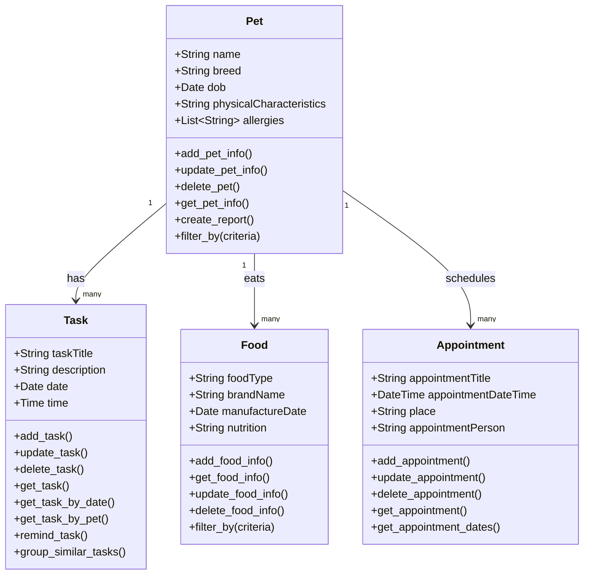

# PawPal+ Project Reflection

## 1. System Design

**a. Initial design**

- Briefly describe your initial UML design.
- What classes did you include, and what responsibilities did you assign to each?

- a user should be able to all CRUD actions related to a pet
- a user should be able to manage tasks related to a pet
- a user should be able track the general health of a pet

### classes

    class:Pet
    attributes:
        name
        age/DOB
        breed
        physical characteristics
        allergies

    methods:
        add_pet_Info
        update_pet_Info
        delete_pet
        get_pet_Info
        create_report
        filter_by(criteria)

    
    class: Task
    attributes:
        task_title
        description
        date
        time
        

    methods:
        add_task
        update_task
        delete_task
        get_task
        get_task_by_date
        get_task_by_pet
        remind_task
        group_similar_task

    class: Food
    attributes:
        food_type
        brand name
        manufacture date
        nutrition

    methods:
        add_food_info
        get_food_Info
        update_fod_Info
        delete_food_Info
        fitlert_by(criteria)
    

   class: Appointment

   attributes:
        appointment_title
        appointment_date_time
        place
        appointment_person
   
   methods:
        add_apointment
        update_appointment
        delete_appointment
        get_appointment
        get_appointment_dates

**Mermaid.js Class Diagram**

**b. Design changes**

- Did your design change during implementation?
- If yes, describe at least one change and why you made it.

---

## 2. Scheduling Logic and Tradeoffs

**a. Constraints and priorities**

- What constraints does your scheduler consider (for example: time, priority, preferences)?
- How did you decide which constraints mattered most?

**b. Tradeoffs**

- Describe one tradeoff your scheduler makes.
- Why is that tradeoff reasonable for this scenario?

---

## 3. AI Collaboration

**a. How you used AI**

- How did you use AI tools during this project (for example: design brainstorming, debugging, refactoring)?
- What kinds of prompts or questions were most helpful?

**b. Judgment and verification**

- Describe one moment where you did not accept an AI suggestion as-is.
- How did you evaluate or verify what the AI suggested?

---

## 4. Testing and Verification

**a. What you tested**

- What behaviors did you test?
- Why were these tests important?

**b. Confidence**

- How confident are you that your scheduler works correctly?
- What edge cases would you test next if you had more time?

---

## 5. Reflection

**a. What went well**

- What part of this project are you most satisfied with?

**b. What you would improve**

- If you had another iteration, what would you improve or redesign?

**c. Key takeaway**

- What is one important thing you learned about designing systems or working with AI on this project?
